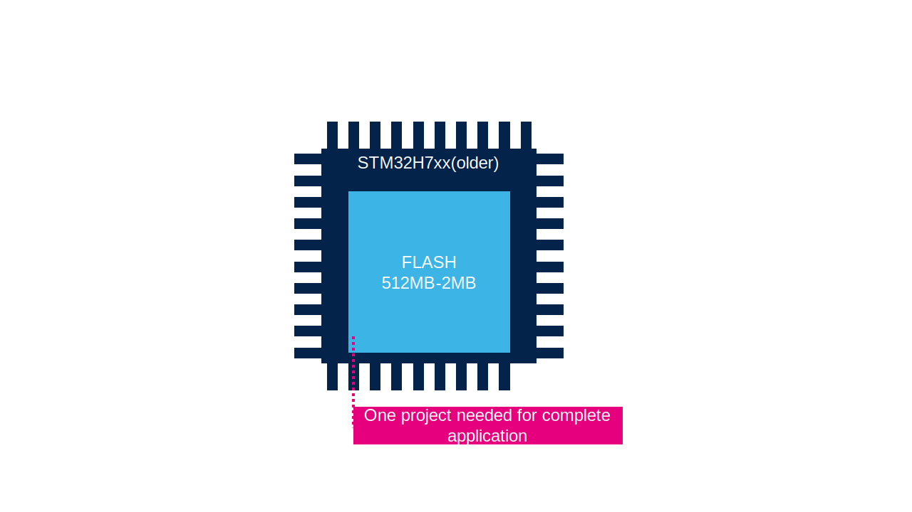
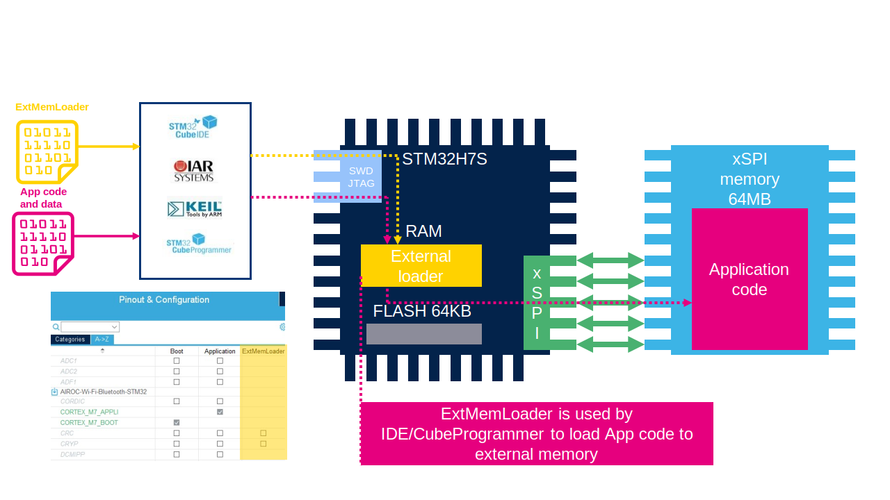

# Standard MCUs with Embedded Flash Memory

In this case, there is only one project (application) stored in the internal flash memory (simplified scenario).
Here, we benefit from integration and a more compact design with fewer components on the PCB, but with limited flexibility in memory size and scalability.

# MCUs with External Memory - Bootloader

For MCUs with external memory, we need a project with boot code that runs from the internal flash memory after a reset. 
This code initializes the hardware and prepares the system to run the application code.

# MCUs with External Memory - Application

The application code itself is another project. 
Unlike the bootloader, it will be residing in external memory.

# MCUs with External Memory - External Memory Loader

We need to create an additional project called external memory loader to manage the external memory, mainly to download the code into external memory.
The external memory loader allows us to handle the external memory (read/write/erase) without needing any additional hardware. While it's being used, it's loaded into internal SRAM.

# So, what do we need?

## Using the old approach

We need to manually create three different projects:

- Bootloader
- Application
- External Memory Loader

We need to thoroughly read the external memory datasheet to understand how to work with it. 
Then, we should implement all necessary functions into the Bootloader and External Memory Loader.

## STM32CubeMX for STM32H7R/S

The great news is that all this can be done by **STM32CubeMX**
STM32CubeMX can generate all three projects.

With **SFDP** and **ExtMem Manager**, we can automatically configure the memory without needing to be familiar in detail with the specific memory devices. 

# STM32H7R/S bootflash MCU + OSPI example

The example will guide you through creating a project based on an STM32H7R/S bootflash MCU with OSPI interface.
The bootflash MCU comes with a small embedded Flash (64KB) used primarily for the initial boot sequence with user application residing in external memory.
OSPI (Octal Serial Peripheral Interface) utilizes eight data lines to connect an external NOR flash memory to the MCU.
We'll be utilizing the NUCLEO-H7S3L8 board as our hardware platform.

# What we will create

1. Bootloader: to configure necessary hardware incl. the OSPI and jump to the application in external memory
2. External Memory Loader: to access and manage the external memory (read/write/erase)
3. Application: a simple application firmware that toggles an LED, which will be located in the external flash memory

# Prerequisites

- STM32CubeMX v6.11.1 or newer
- STM32CubeIDE v1.15.1 or newer (or a different IDE)
- STM32CubeProgrammer v2.16.0 or newer 
- NUCLEO-H7S3L8 development board
- USB-C cable

If your system need **admin rights** to access `Program Files`. We recomend to install STM32CubeIDE and STM32CubeProgrammer on different location. It is for External memory loader which can be copyed to STM32CubeProgrammer & STM32CubeIDE automatically with script. But it will not work if you can't access Program Files without permitions. 

## Complete handson:

[Link](https://github.com/ST-TOMAS-Examples-ExtMem/stm32h7rs_ospi)

# [CubeProgrammer part](2_extmem_programmer.md)