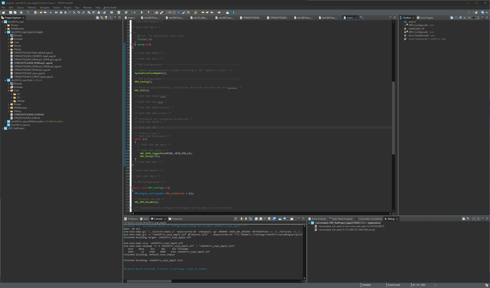
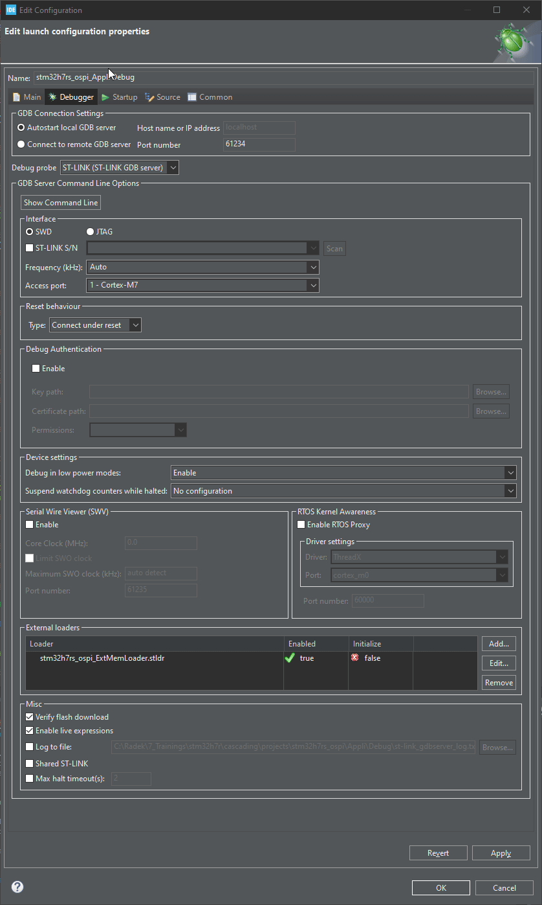

# Add code

1. Open STM32CubeIDE
2. Import Project to STM32CubeIDE or let STM32CubeMX to import the project for you.
3. You should have one main project and three sub projects in the workspace. 

4. Open Application project and its main.c
5. Add there the code for GPIO toggling

```c
	  HAL_GPIO_TogglePin(GPIOD, GPIO_PIN_13);
	  HAL_Delay(500);
```

Into the infinite loop:

```c-nc
  /* Infinite loop */
  /* USER CODE BEGIN WHILE */
  while (1)
  {
    /* USER CODE END WHILE */

    /* USER CODE BEGIN 3 */
	  HAL_GPIO_TogglePin(GPIOD, GPIO_PIN_13);
	  HAL_Delay(500);
  }
  /* USER CODE END 3 */
}
```

6. Open Bootloader project
7. Go to main.c
8. Go to main function 
9. Add Cache invalidation functions

```c-nc
  /* USER CODE BEGIN 1 */

  SCB_InvalidateDCache();
  SCB_InvalidateICache();
  /* USER CODE END 1 */
```

```c
  SCB_InvalidateDCache();
  SCB_InvalidateICache();
```
This is done because, after a reset, the cache may contain invalid data. The JumpToApplication function will clean the cache, and these invalid records could otherwise cause a hard fault.

# Compile

10. Compile all projects.
11. Select Application project and run debug



12. Ensure that the generated external memory loader is present in the Debugger tab. 
It should appear automatically, thanks to the postbuild script "postbuild.sh" (part of the ExtMemLoader project). If it does not appear, it may be due to insufficient administrative privileges, which can prevent the postbuild script from copying files to the protected location on the C: drive.

If this issue occurs, follow these steps:

`1.` Locate the build output file (*.elf) in the ExtMemLoader project's Debug folder.<br>
`2.` Rename the file to the *.stldr format.<br> 
`3.` Add the renamed file to External Loaders in the Debugger tab (under Debug Configurations...). 

13. Go to Startup tab
14. Add Bootloader code, so that it will be built, the executable file transferred to the target MCU,
and the debugging information loaded into the debugger.
15. Click OK



If you are using the application for debugging, you will encounter a HardFault exception immediately upon starting. This occurs because the debugger starts the application directly without resetting the device. To address this, you must manually click 'Reset' to physically reset the device, which allows it to jump to the bootloader, and then proceed to run the application.


# Conclusion


* We created a bootloader to use ExtMem manager to setup OSPI
* We created simple GPIO toggle application
* We created e ExternaLoader for IDE and also for STM32CubeProgrammer 
