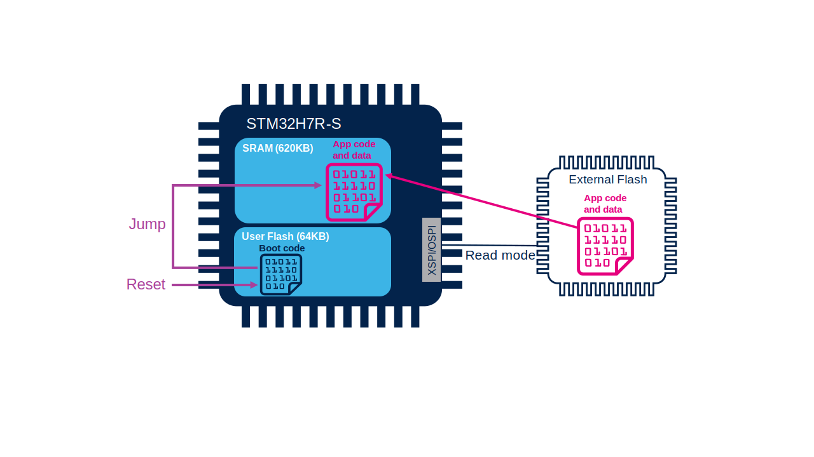

# External memory manager (Extmem_manager)

Is software which can help you to configure a external memory and handle read write into this memory. 

Currently it will support
- SFDP_NOR_xspi
- SDCARD
- PSRAM

## NOR -SFDP memory

### What is SFDP?

Itn is a part of memory defined by JETEC standard. It allow to discovery features of memory. The Extmem_manager use it to learn how to work with memroy. 

[JEDEC Link](https://www.jedec.org/standards-documents/docs/jesd216b)

### Usage of Extmem_manager

It will automatically configure the memory. And will handle read/writes into selected memory. 
It can be used in bootloader and in external loader.

## Memory modes

### Execute in place

The code is directly executed from memory

### Load and Run

Core is first loaded to RAM and then excuted there.

Mainly fro not mapped memories like SDCard
Or for slow external memories

## Memory configuration

The ExtMem Manager will try to set maximum speed on xSPI related to info provided by memory. Here you need to pay attention if the memory is running at <2.6V the user must enable HSLV feature