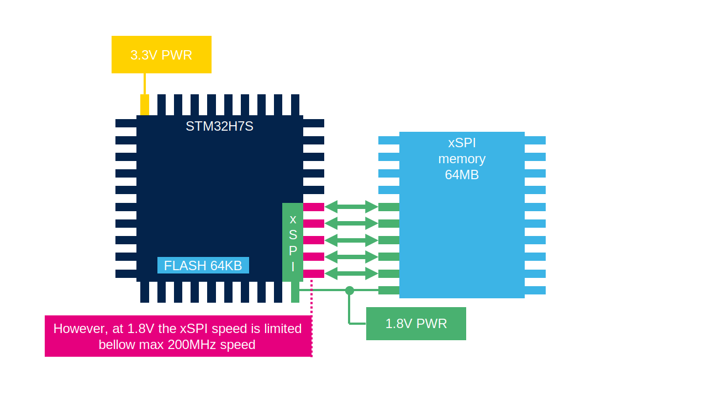

# HSLV - High speed low voltage

The xSPI1/2 have independent power domains. They can from from 1.8V to 3.3V. 
However to 2.6V they can run at 200MHz. But below the speed is reduced. 
To solve this issue a HSLV feature can be enabled to allow the pins run max speed. 

This must be done in:
- SBS periphery
- And in Option bytes

Both must be applied to have HSLV functional.

> [!CAUTION]
> If HSLV is used and power of xSPI is >2.6V it will damage the device

