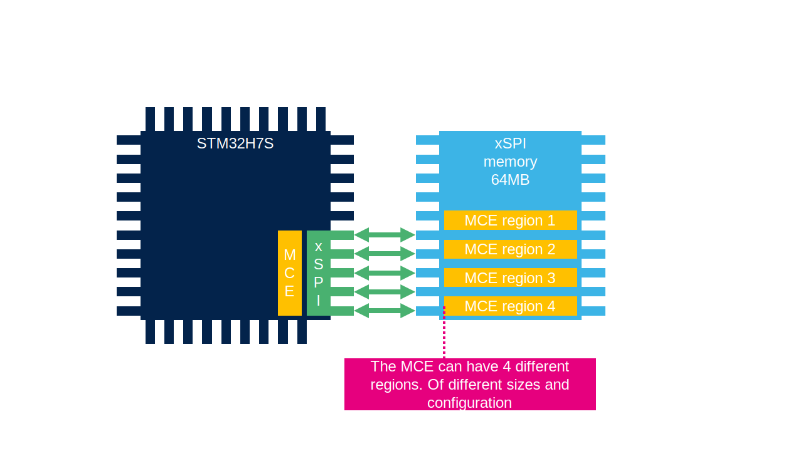

# MCE

Unit can encrypt/decrypt content on xSPI/FMC

## MCE units

We have three MCE units

- for XSPI1
- for XSPI2
- for FMC

### MCE1

Use ASE for encryption/decryption

Modes:
 - Stream - faster for code execution, read only
 - Block - slover than streem but more secure

Speed selection:
- normal
- fast - less secure but faster

### MCE2 & MCE3

Use Noekeon for encryption/decryption

Modes:
 - Block only

Speed selection:
- normal
- fast - less secure but faster

## MCE structure

MCE can have 4 regions with different configuration. 

Each region can cover different address range. 
Can define if the encryption will be used for read/write or not. 

