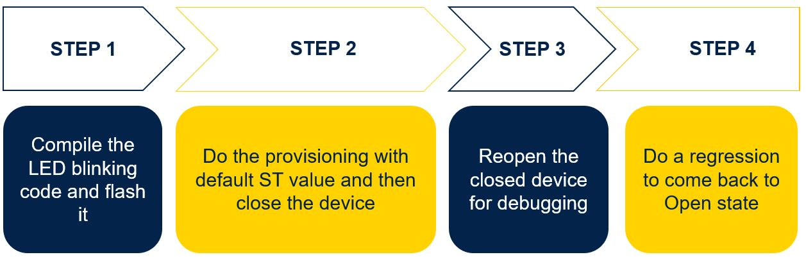
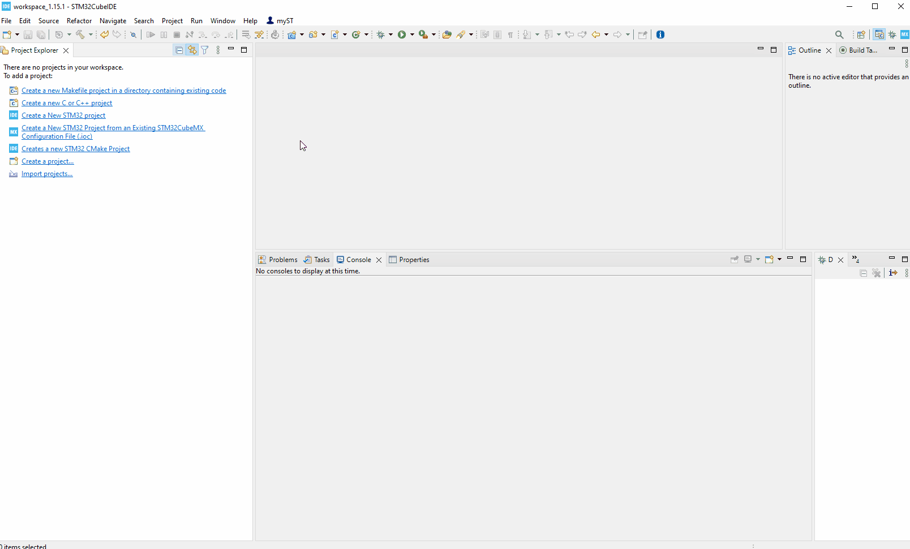
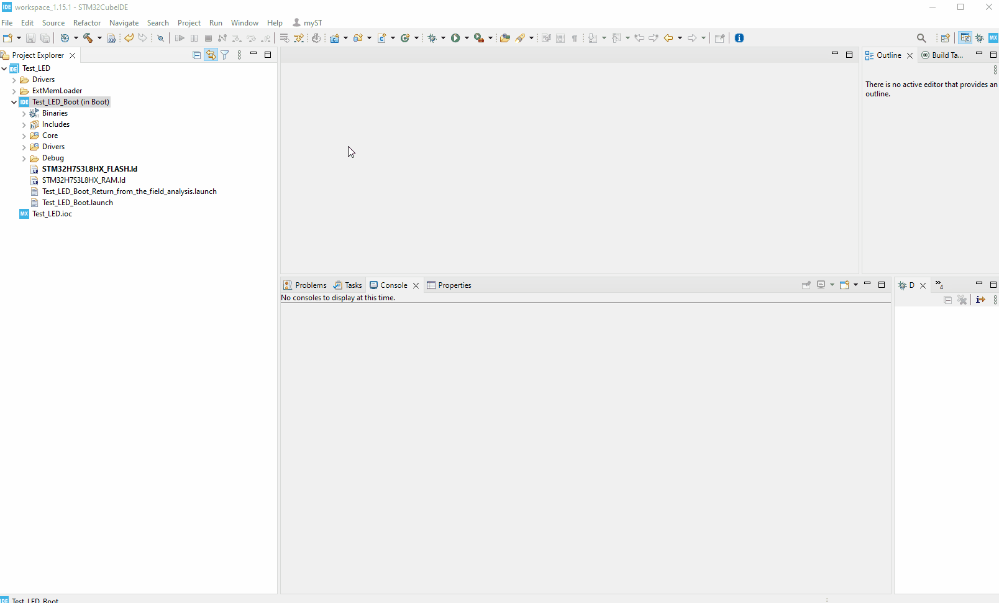
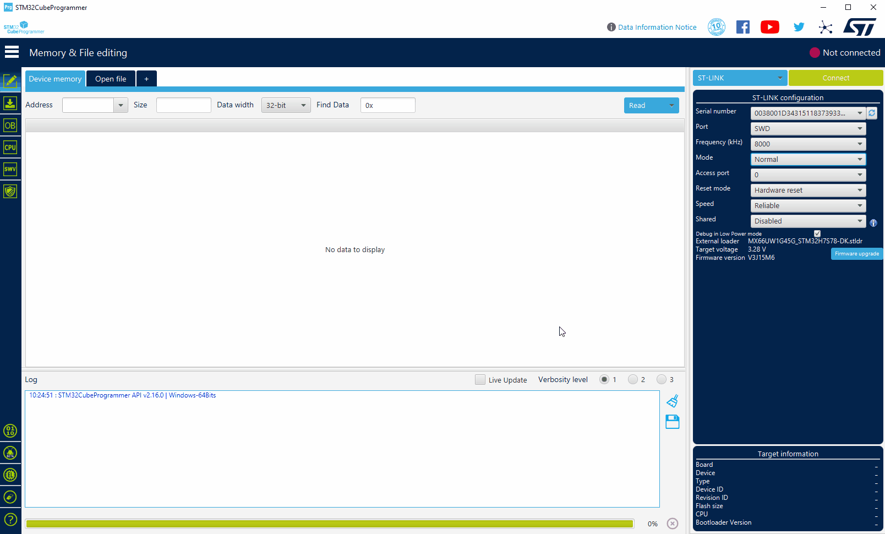
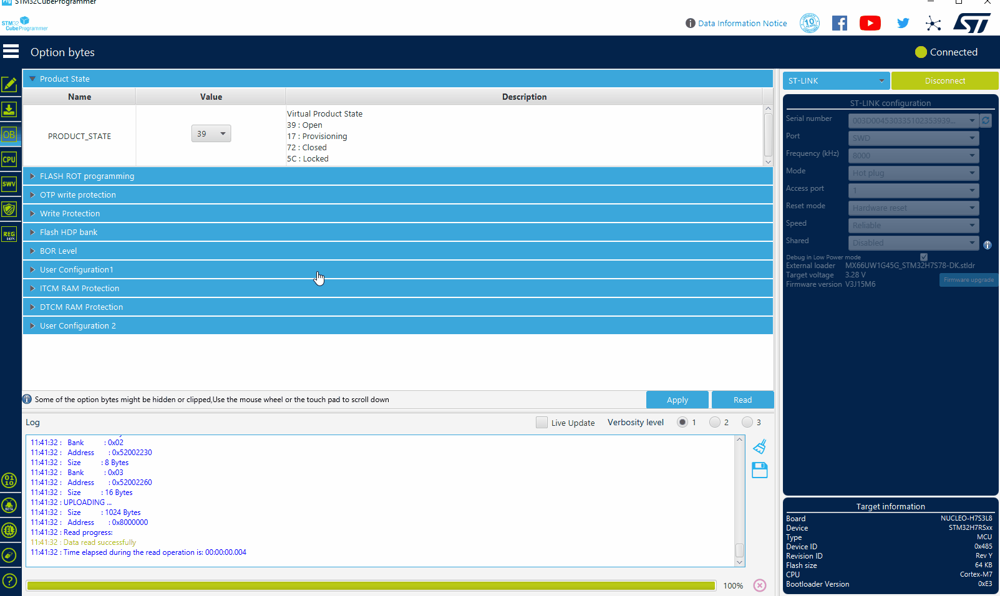
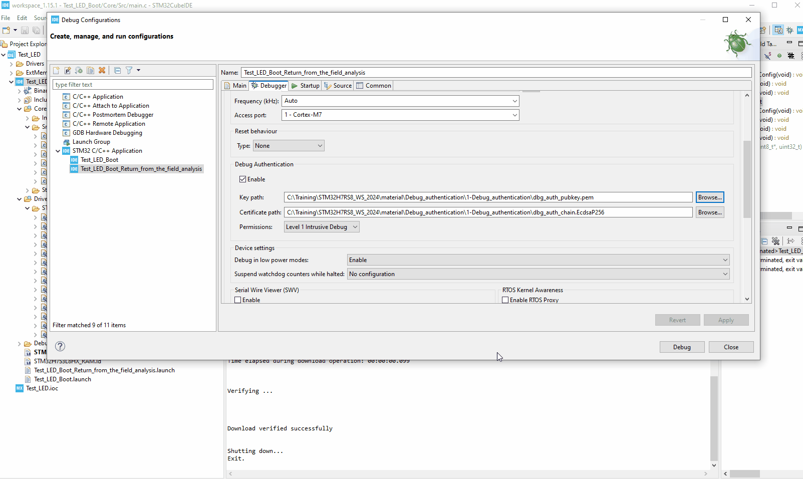
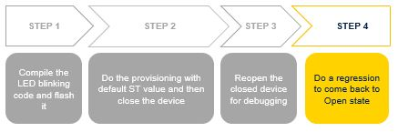
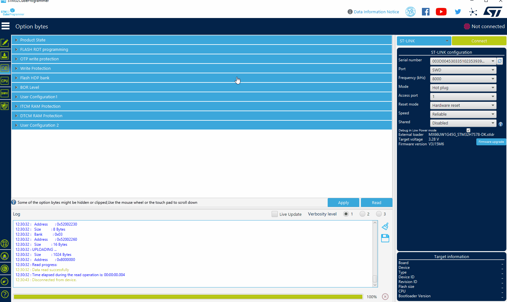
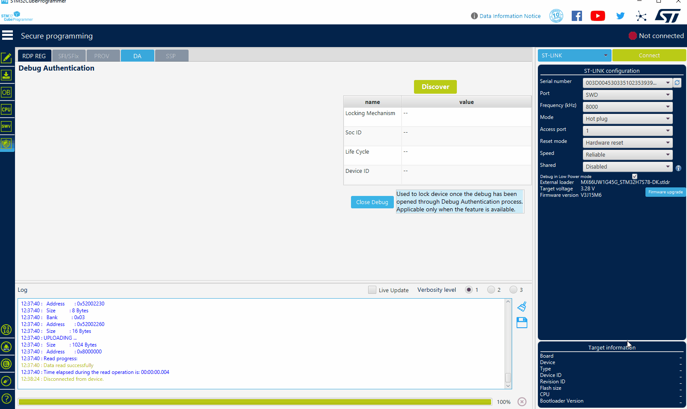

# STM32H7RSWorkShop-Debug authentication demo

[Project Link](https://github.com/ST-TOMAS-Examples-Security/stm32h7rs_debug_authentication)

The example will guide you through a board provisionning with ST default credential, close the debug port of the board. Then using the debug authentication feature with certificate, we will re-open the debugging link for debuging and also for triggering a platform regression.  

## Prerequisites

- NucleoH7S3L8 board
- USB type C cable
- CubeIDE 1.15.1 (or upper) with STM32H7RSCube V1.0.0 (or upper)
- CubeProgrammer 2.16.0 (or upper)

## Key Steps for the Hands-On 

  

## Step 1 : Compile LED blonking code and flash it

### Import the project 

1. Launch Cube IDE
2. Go in Menu `File -> Open Projects from file system...`
3. Select the folder `STM32H7RSWorkShop-Debug_authentication\0-LED blinking project\Test_LED`
4. `Finish`
   
  

### Compile and download the project

1. Select the `Test_LED_Boot`
2. Go in Menu  `Run`->`Debug As`-> `1 STM32C/C++ Application`
3. Select debug configuration `Test_LED_Boot`, then `OK`
   
  

4. Run the application, then stop the debug session
   
  

- LED LD2 orange is blinking 
  
## Step 2 : Provision the target with ST default credential and close the device

  

### Let's provision the board !

1. Launch STM32CubeProgrammer
2. Select connect mode `Hotplug`, this is a must !
3. Click on `Connect`
4. Select icon for the option byte `OB`
5. Select `Product State`
   
  

6. Change the value from `39` to `17`
7. Select  `Apply`
8. On the pop-up "Do you want to provision a Deafult DA-Config? ", select `YES`
9. On the Warning pop-up, click `OK`
10.  On the Message pop-up "OBKey Provisioned successfully....", click `OK`
11.  On the Message pop-up "Secure Option Byte set up succeeded", click `OK`
    
  

### Let's close the board !

1. Change product state value from `17` to `72`
2. Select  `Apply`
3. On the message pop-up : "Warning : Product state requested, verification could not be done", click `OK` 
4. On the message pop-up : "Secure Option Byte set up succeeded", click `OK` 
5. On the message pop-up : "Warning : Connection to device 0x.... is lost", click `OK` 
6. On the message pop-up : "Error : failed to reconnect after reset", click `OK` 
  
  

The device is closed and our LED is blinking ! Device is ready to go on the field.

## Step 3 : Reopen the device for debug

  

1. Open STM32CubeIDE
2. Select the `Test_LED_Boot`
3. Go in Menu  `Debug configurations...`
4. Select `Test_LED_Boot_Return_from_the_field_analysis`
5. Select  `Debugger` tab
   
  
  
6. In debug authentication update `Key path`, thanks `Browse...`
7. set it to your installation path  `...STM32H7RSWorkShop-Debug_authentication\1-Debug_authentication\dbg_auth_pubkey.pem`
8. In debug authentication update `Certificate path`, thanks `Browse...`
9. Set it to your installation path
`...STM32H7RSWorkShop-Debug_authentication\1-Debug_authentication\dbg_auth_chain.EcdsaP256 `

### WARNING : the Key/ Certificate path should not contain any space character !

  

10.   Click on Debug
11.  Please break and then you can debug your application
  

12.  Close the debug session `Terminate` icon

## Step 4 : Let's do a regression and reopen the device

  

### Close the debug link opened previously

  1. Launch STM32CubeProgrammer
  2. Select the `shield ` icon
  3. Select `DA` tab
  4. Click on `Discover`
  5. Click on `Close Debug`
  6. On the message pop-up : `Target successfully locked`, click `OK`

   

### Debug authentication to trig a regression

  1. Click on `Discover`
  2. Update `Key File path`, thanks `Browse...`
  3. Set it to your installation path
  `...STM32H7RSWorkShop-Debug_authentication\1-Debug_authentication\dbg_auth_pubkey.pem`
  4. Update `Certificate path`, thanks `Browse...`
  5. set it to your installation path
  `...STM32H7RSWorkShop-Debug_authentication\1-Debug_authentication\dbg_auth_chain.EcdsaP256 `
  6. Click on `Continue`
   
      

  7. Select `Full regression`
  8. Select `Execute`
  9.  On the message pop-up : `Debug Authentication Sucess`, click `OK`
   
    

  10. Select icon for the option byte `OB`
  11. Select `Product State` and check the value is `39` Open state
   
        

