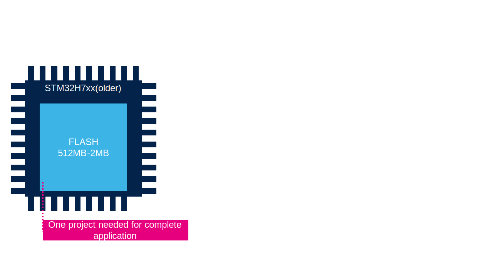
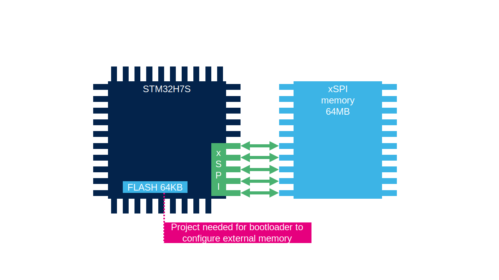
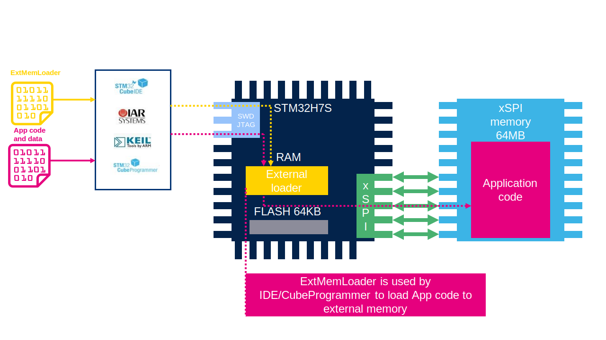
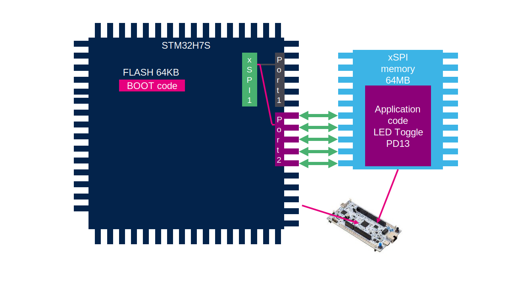

----!
Presentation
----!

# Devices with memory

There is only one project stored in internal FLASH.

# Device with external memory boot code

On device with external memory we need one projectfor internal boot memory

# Device with external memory application code

We need one project for application code which will be in external memory

# Device with external memory, put code on external memory

And we need create external loader to put code into external memory

# What we need then?

## Use old approach

We need to create threee projects:

- Bootloader
- Application
- External loader

We need to read all `External Memory datasheet` to lear how to work with it. And impleent all this functions into `Bootloader` and `External Loader`

## With CubeMX for H7RS

All this can be done with **STM32CubeMX**
STM32CubeMX now create all three projects

With **SFDP** and **ExtMem Manager** we can automatically configure the memory. Without deep knowledge how memory works. 

# STM32H7R/S bootflash MCU + OSPI example

The example will guide you through creating a project based on an STM32H7R/S bootflash MCU with OSPI interface.
The bootflash MCU comes with a small embedded Flash (64KB) used primarily for the initial boot sequence with user application residing in external memory.
OSPI (Octal Serial Peripheral Interface) utilizes eight data lines to connect an external NOR flash memory to the MCU.
We'll be utilizing the NUCLEO-H7S3L8 board as our hardware platform.

# What we will create

1. Bootloader: to configure necessary hardware incl. the OSPI and jump to the application in external memory
2. External Memory Loader: to access and manage the external memory (read/write/erase)
3. Application: a simple application firmware that toggles an LED, which will be located in the external flash memory

# Prerequisites

- STM32CubeMX
- STM32CubeIDE (or a different IDE)
- NUCLEO-H7S3L8 board

## Complete handson:

[Link](https://github.com/ST-TOMAS-Examples-ExtMem/stm32h7rs_ospi)