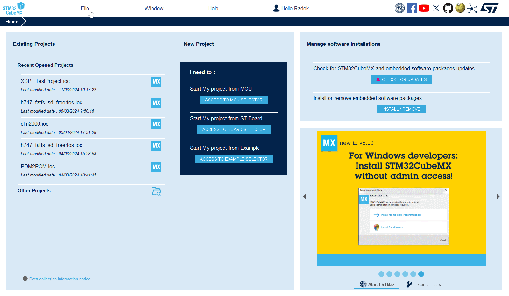
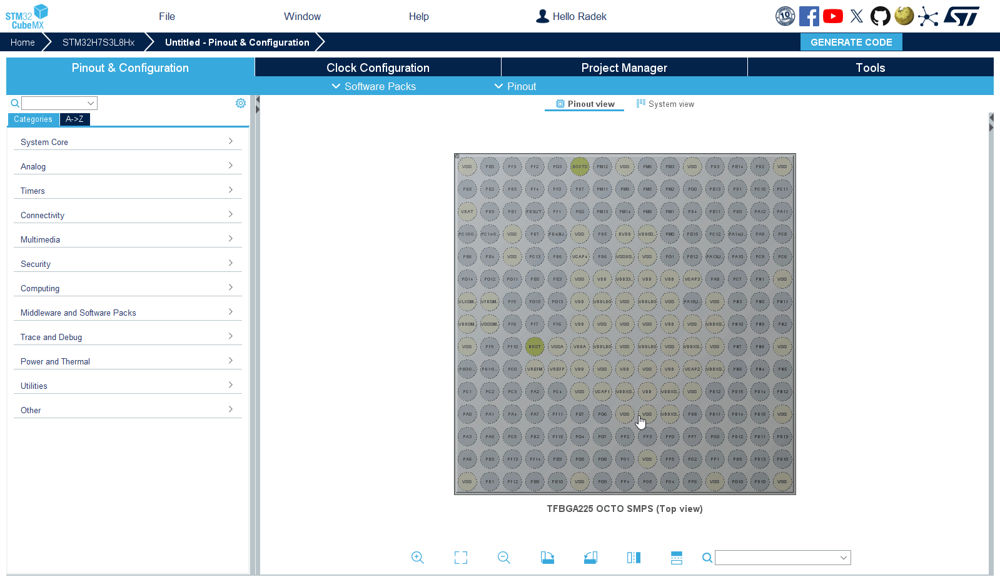
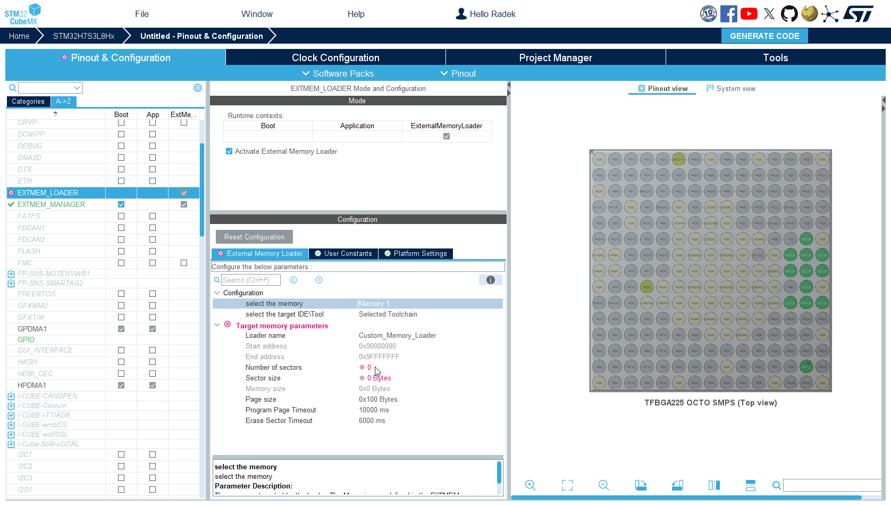

----!
Presentation
----!

# STM32CubeMX 

## Project startup

### 1. Run STM32CubeMX
### 2. Menu>File>New Project...



### 3. Search for STM32H7S3L8H6 (same as on NUCLEO-H7S3L8)


### 4. Start a new project 

### 5. Respond to the pop-up by agreeing to apply the default configuration for the Memory Protection Unit (MPU)


# STM32CubeMX configuration for STM32H7R/S

In case of the STM32H7R/S series STM32CubeMX allows each peripheral to be set up for use with the Bootloader, Application, and External Memory Loader.


## Bootloader 
Its task is to initialize the system's hardware, system clock and particularly the serial memory interface (OSPI) and hand over the code execution to the main application firmware in external memory.
The bootloader code will be placed into the MCU's internal flash.

## Application 
This is our main application firmware. Our main application's code will reside in external memory and will be linked to the OSPI memory region.

## External Memory Loader
It initializes the serial memory interface (OSPI) and then enables to manage the external memory, allowing for programming, reading, and erasing of its contents. 
During its use, the code is loaded into MCU's internal SRAM and executed from there, ensuring the internal flash content remains unchanged.
It can be used with multiple programming tools, such as STM32CubeIDE, STM32CubeProgrammer, IAR EWARM, Keil-MDK.


# Pinout

We start with LED

1. The LED is connected to PD13; configure it as an output. 



2. Right-click on the pin and select Pin Reservation -> Application
  


Pin reservation allows you to specify which application has access to use the pin.

# PWR configuration

1. Select RCC
2. Set Supply Source to PWR_LDO_SUPPLY (the NUCLEO-H7S3L8 board features an LDO and does not include an SMPS)


# MPU confguration

By default, the MPU disables access to external memory, so we need to enable it.

Confiogure MPU in `CORTEX_M7_BOOT` 
We'll be able to access the OSPI memory region, allowing code to be executed from there and utilizing the core cache.

1. Open `CORTEX_M7_BOOT`
2. Region 1 `enable`
3. Region base address `0x90000000`

```c
0x90000000
```

4. Region size `32MB`
5. Access permission to `ALL ACCESS PERMITTED`
6. Instruction access `ENABLE`
7. Cacheable `ENABLE`
8. Bufferable `ENABLE`


In `CORTEX_M7_APPLI` we will disable MPU config this will use config from `CORTEX_M7_BOOT`

9. Open `CORTEX_M7_APPLI`
10. Set **MPU Control Mode** to` MPU NOT USED`


# XSPI Mode

We will utilize the XSPI1 (Extended-SPI interface for connecting with external serial memory devices)

xSPI1 is connectd to port1 and port2 on Nucleo the memoryis on port2


1. Select XSPI1 configuration for `Bootloader` and for `External loader`
   


2. Select XSPI1
3. Select Mode to `Octo SPI`
4. Select port to `Port 2 Octo`
5. Select Chip select override to `NCS1 - Port 2`


# XSPI configration

1. Select Memory type to `Macronix` (memory on the NUCLEO-H7S3L8 board) 
2. Memory size to `32 MBytes`
3. Chip Select High Time Cycle to `2`
4. Set De;ay Hold Quarter Cycle to `Enable`


# SBS configruation

The OSPI is powered by the XSP2 domain, which operates at 1.8V. Therefore, the HSLV (High-Speed Low-Voltage) feature must be utilized.
HSLV is a characteristic of certain I/O ports that allows them to operate at higher speeds while using lower voltage levels. 
This feature is particularly useful for applications that require fast data transfer rates without the higher power consumption typically associated with standard voltage levels.

The SBS must be still enabled in option bytes. 
Ensure that you enable the HSLV (High-Speed Low-Voltage) feature only when the domain is actually operating at low voltage!!! 
Activating HSLV while the memory is powered by 3.3V could potentially damage the STM32 MCU!
There is no built-in hardware protection, therefore the user bears complete responsibility for ensuring that the HSLV feature is activated under the correct conditions.


1. Select SBS for `Bootloader` and `External Loader`
2. Select the SBS peripheral
3. Activate SBS
4. Set IO HSLV for XSPIM2 to `ENABLE`


The `IO HSLV for XSPIM2` is chosen because Port 2 is utilized for XSPI1.


# EXTMEM_MANAGER - External Memory manager

It's a middleware that can automatically configure the external serial memory interface (xSPI), provided that the memory supports the SFDP standard (Serial Flash Discoverable Parameters defined by JEDEC), or is connected to SDMMC.
Utilizing SFDP-compliant memory allows the STM32 MCU to automatically detect and set up memory parameters, which ensures compatibility and simplifies integration process.

1. Select the EXTMEM_MANAGER middleware for `Bootloader` and External Loader(enabled by default)
2. Check `Activate External Memory Manager`


3. Go to Boot usecase tab
4. Check `select boot code generation`


We keep the Execute in Place option, which means the code will be executed directly from external memory. 
The alternative option, 'Load and Run,' means that the code will be transferred from external memory into RAM (either internal SRAM or another external memory) for execution.
Memory is `Memory 1 `

5. Go to Memory 1 tab
6. Select Number of memory data line to `EXTMEM_LINK_CONFIG_8LINES`


For everything else retain the default settings - Memory driver is `EXTMEM_NOR_SFDP`
and memory instance is `XSPI1`

# EXTMEM_LOADER

1. Select the EXTMEM_LOADER middleware
2. Check Activate External Memory Loader


3. Select `External Memory Loader` tab
4. Set number of sector to `8192`
5. Set Sector size to `4096`

All these parameters are taken from the memory datasheet.

You can rename the `loader name` for easier recognition if necessary. 
Additionally, the `programmming/erase time` can be further optimized according to the specifications in the memory datasheet."




# Clock Configuration

1. Go to `Clock Configuration` tab
2. Set HCLK to 600MHz


1. Set XSPI clock to 200 MHz
   1. Set XSPI1 Clock mux to `PLL2S`
   2. Set DIVM2 to `/4`
   3. set DIVN2 to `50`
   4. Set DIVS2 to `/4`


On the STM32H7R/S, the XSPI (the interface for connecting with external serial memory devices) is capable of operating at speeds of up to 200 MHz in DTR (Double Transfer Rate) mode.

# Project Manager

1. Navigate to the `Project Manager` tab
2. Choose a name for your project and select its location 
3. select `ExtMemLoader Project`
4. Select STM32CubeIDE as the Toolchain
5. Generate Project


# STM32CubeProgrammer

1. Click to `Connect`
2. Select `Option bytes`
3. Select `User configuration 1`
4. Enable `XSPI2_HSLV`

