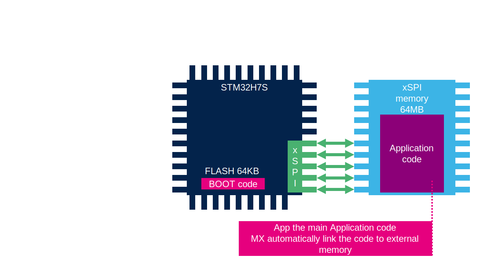

# STM32CubeMX configuration for STM32H7R/S

In case of the STM32H7R/S series STM32CubeMX allows each peripheral to be set up for use with the Bootloader, Application, and External Memory Loader.

## Bootloader 
Its task is to initialize the system's hardware, system clock and particularly the serial memory interface (OSPI) and hand over the code execution to the main application firmware in external memory.
The bootloader code will be placed into the MCU's internal flash.

## Application 
This is our main application firmware. Our main application's code will reside in external memory and will be linked to the OSPI memory region.

## External Memory Loader
It initializes the serial memory interface (OSPI) and then enables to manage the external memory, allowing for programming, reading, and erasing of its contents. 
During its use, the code is loaded into MCU's internal SRAM and executed from there, ensuring the internal flash content remains unchanged.
It can be used with multiple programming tools, such as STM32CubeIDE, STM32CubeProgrammer, IAR EWARM, Keil-MDK.

