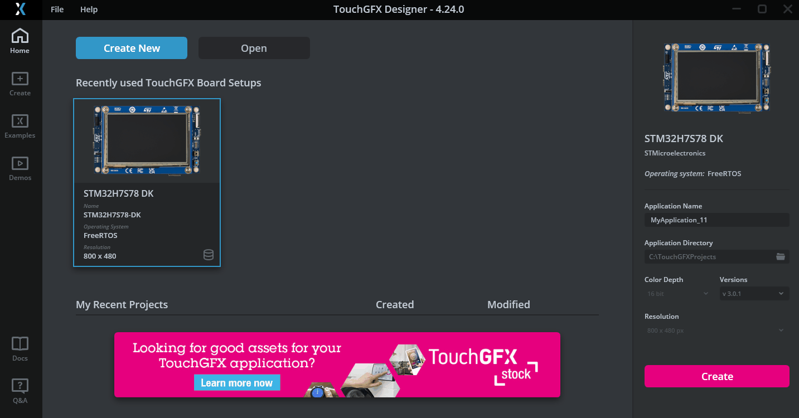
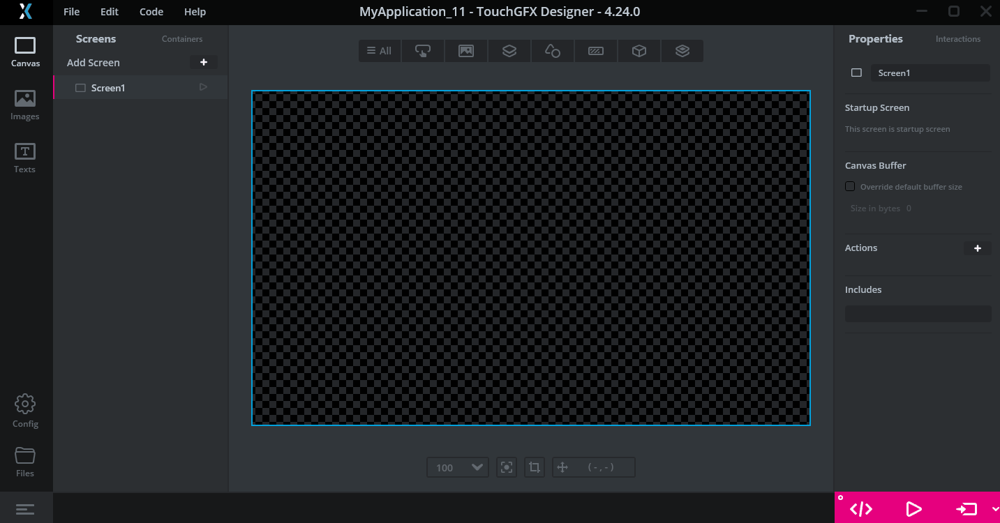
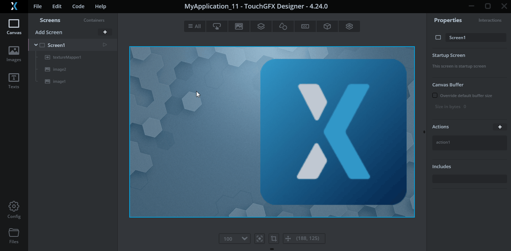
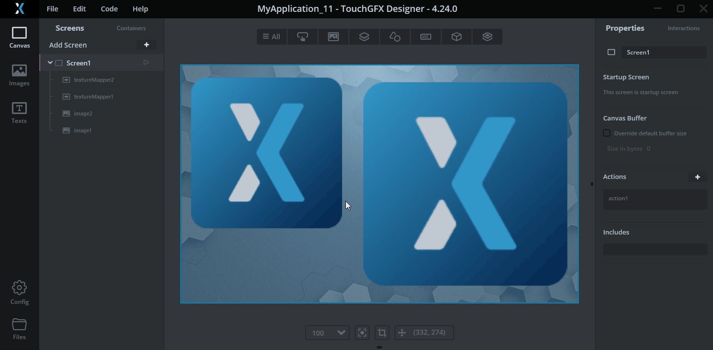

# STM32H7RSWorkShop-Benefit of NeoChrom Demonstration

The example will guide you through creating a graphical user interface on STM32H7S78-DK which demonstrate the benefit of 
NeoChrom GPU. We will use TouchGFX designer tool to create this interface which is composed of  two icon that continously 
rotating and a button which allows to activate/deactivate NeoChrom IP.

## Prerequisites

- TouchGFX Designer 4.24.0 
- STM32H7S78-DK board
- USB type C cable

## TouchGFX Designer 4.24.0
 3 main steps will be needed :
1. Create a project and add the widgets (background image, two texture mapper and a toggle button) 
2. Add interactions to made the texture mapper rotate and to activate/deactivate NeoChrom 
3. Compile / download and test the generated project  

## 1. Create a project and add the widgets (background image, two texture mapper and a toggle button) 

 - Run TouchGFX Designer 4.24.0

### 1.1. Create New project targetting the STM32H7S78-DK board
  
### 1.2. Add an image 
  
### 1.3. Select a image with the screen size (800x480)
  
### 1.4. Add a first texture mapper
  - Add texture mapper widget
  - Increase scale to `2.7`
  - Resize and relocate the widget 
  
### 1.5. Add a second texture mapper
  - Add an other texture mapper widget
  - Increase scale to `2`
  - Resize and relocate the widget 
  
### 1.6. Add a toogle button 
  - Add a toogle button widget
  - Change the preset of this widget
  - Relocate the widget 
  

## 2. Add the interaction
### 2.1 Rotation of the texture mapper 1
  - Add a new interaction 
  - Trigger : `On every N ticks`
  - Action : `Rotate the texture mapper`
  - Choose texture mapper : `textureMapper1`
  - Tick relative angle
  - Z angle :  `0.1`
  

### 2.2 Rotation of the texture mapper 2
  - Add a new interaction 
  - Trigger : `On every N ticks`
  - Action : `Rotate the texture mapper`
  - Choose texture mapper : `textureMapper2`
  - Tick relative angle
  - Z angle :  `-0.1`
  

### 2.3 Add the activation / deactivation of NeoChrom
  - Add a new intercation 
  - Trigger : `button is clicked`
  - Action : `Execute C++ code`
  - Code : copy the code below
  ```c
  #ifndef SIMULATOR
  static uint8_t b_NeoChromEnabled = 1;
    if (b_NeoChromEnabled)
    {
      b_NeoChromEnabled = 0;
       // function natively in TouchGFX for STM32H7RS
      ((TouchGFXHAL*)touchgfx::HAL::getInstance())->activateNeoChrom(false); 
    }
    else
    {
      b_NeoChromEnabled = 1;
      // function natively in TouchGFX for STM32H7RS
      ((TouchGFXHAL*)touchgfx::HAL::getInstance())->activateNeoChrom(true); 
    }
  #endif /*SIMULATOR*/
  ```
  

  - Include : copy the code below
  ```c
    #ifndef SIMULATOR
    #include <TouchGFXHAL.hpp>
    #endif/*SIMULATOR*/
  ``` 
  

## 3. Compile and download to the target
  - connect STM32H7S78-DK CN7 to your PC
  - launch `Program and Run to Target`
    
  - Result on the target. Much more fluid on target than on this gif capture !  
    

