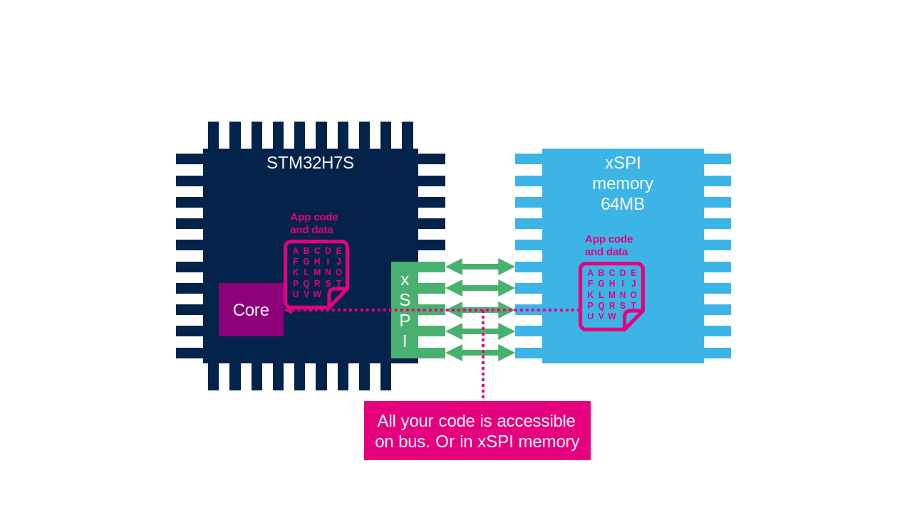

----!
Presentation
----!

# Can we read out the content of external memory?

The extenral memory content if fully visible to anyone who will connect on the bust or read the external memory. 

# How to prevent it?

We can use MCE unit which can encrypt and decrypt data from xSPI/FM if they are memory mapped. 

# STM32H7R/S bootflash MCU + OSPI + MCE example

We will utilize an existing OSPI example for the STM32H7R/S series, which can be found under
[this link](https://github.com/ST-TOMAS-Examples-ExtMem)

In this example, the Memory Cipher Engine (MCE) will be employed to protect our code and data through the on-the-fly encryption/decryption. 
The Memory Cipher Engine (MCE) will encrypt the data within the external memory loader, while decryption will be carried out in the bootloader or the application itself.

# Complete handson

[Link](https://github.com/ST-TOMAS-Examples-ExtMem/stm32h7rs_ospi_mce)

Uncomment version

[Link](https://github.com/ST-TOMAS-Examples-ExtMem/stm32h7rs_ospi_mce/releases)